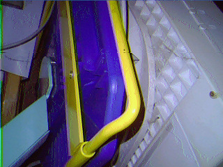

# Camera Webserver ESP32-CAM for the OV7670 camera modul

- experimental webserver for OV7670 FSL (with Flexcable)  
  adapted from: https://github.com/xenpac/ESP32-CAM-Linux-Motion
- ESP-IDF V3.3.1 LTS project, C code.

## Overview

This is an experimental project to play with **OV7670 camera modul** being plugged in into the **esp32-cam board**.

I had this OV7670 camera module lying around and wondered if it could be fitted onto the esp32-cam board into  
the same connector as the original OV2640 camera.

Indeed, the OV7670 FSL is pin compatible with the OV2640, even got the same pin definitions.  
Powersupply fits also.  
So yeah, just plug it in....and use this software.  

This could be adapted to any camera not delivering JPG output.

## What to expect

Well, the OV7670 has one big disadvantage: no JPG mode.(slow streaming)

Its just a simple 640*480 VGA camera that can deliver YUV422 and RGB565.

The image quality is good for indoor fotos, outdoor landscape is a bit too low resolution.  

The OV7670 is soo common and has been around since early 2000's. The "starting point" so to say;)

But yeah, todays price is about the same as the OV2640 (which is much better).

Still, its a legend.

## Web streaming OV7670

To do HTTP-streaming we have 3 choices:
- capture YUV422, convert it to JPG by software, then stream it to the browser. (low network payload)
- capture RGB565, convert it to JPG by software, then stream it to the browser. (low network payload)
- capture RGB565, put a BMP-header in front, then stream it to the browser      (high network payload, but no conversion)  
  This would be the fastest but my esp32-wifi couldnt deliver the traffic fast enough.

The JPG software conversion takes between 100 to 500ms per frame, depending on resolution.

The network streaming framerate is about the same for all 3 modes using wifi:
- 640*480 = 2 fps.
- 320*240 = 7 fps
- 160*120 = 12 fps.

So not that great ...but still doable.

The "IMG tag" on the browser can display the standard image formats like jpg, bmp, png....  
The only format that didnt need a software conversion was BMP.  

To convert RGB565 to BMP, you just put a configured BMP-header in front of the framebuffer and send the whole thing as bmp image.  
(see tcpserver.c->makebmpheader() )  
It is not possible to convert YUV422 to BMP. No fixed masks for the r g b color fields!

## The Webpage

There are 2 new controls.
- streamMode (JPG/BMP) = **JPG** streams as jpg and does software conversion. **BMP** streams direct as BMP (only if RGB565 is selected)
- PixFormat (rgb565/yuv) = This selects the cameras pixelformat that it delivers. RGB565 or YUV422.

**Please** stop streaming before you change any of these 2 settings, otherwise lightning might strike ;)

But there is always the **RESET** button down below in clock settings.

## Software changes 

I did some changes in camera.c do integrate the OV7670.
Also added code to adjust I2S buffer descriptors to changed resolutions, which makes it faster.
That was a quick fix though, still buggy.

Modded the HTML page to adapt special settings.
Changed the tcpserver code a bit / BMP Header stuff.

Added OV7670.c as a sensor file. (80% tested!)

There are binarys in the repo to flash directly.

Have fun ;) xenpac